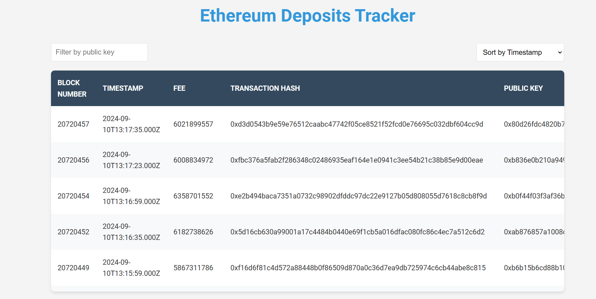

# Ethereum Deposit Tracker(includes docker image)


## Overview

The Ethereum Deposit Tracker application monitors and stores Ethereum deposits on the Beacon Deposit Contract. It uses Node.js and MongoDB and is Dockerized to simplify deployment and management. The Docker image is available on Docker Hub.

## dockersteps


## Docker Image
555yash555/ethereum-deposit-tracker
The Docker image for this project is available on Docker Hub:

```
docker.io/555yash555/ethereum-deposit-tracker:latest
```

## Prerequisites

Before running the Docker container, ensure you have the following installed:

- [Docker](https://docs.docker.com/get-docker/) (for building and running containers)
- [Docker Compose](https://docs.docker.com/compose/install/) (optional, for managing multi-container Docker applications)

## Getting Started

Follow these instructions to access and run the Docker image.

### 1. Pull the Docker Image

To pull the Docker image from Docker Hub, use the following command:

```bash
docker pull 555yash555/ethereum-deposit-tracker:latest
```

### 2. Run the Docker Container

Run the Docker container using the following command:

```bash
docker run -d \
  --name ethereum-deposit-tracker \
  -p 3000:3000 \
  555yash555/ethereum-deposit-tracker:latest
```

- `-d` runs the container in detached mode.
- `--name ethereum-deposit-tracker` assigns a name to the container.
- `-p 3000:3000` maps port 3000 on the host to port 3000 in the container.

### 3. Access the Application

Once the container is running, you can access the application at:

```
http://localhost:3000
```

### 4. (Optional) Using Docker Compose

If you have a `docker-compose.yml` file, you can manage the application and MongoDB services with Docker Compose. Create a `docker-compose.yml` file with the following content:

```yaml
version: "3"
services:
  app:
    image: 555yash555/ethereum-deposit-tracker:latest
    ports:
      - "3000:3000"
    environment:
      - MONGODB_URI=mongodb://mongo:27017/ethereum-deposit-tracker
      - ETH_RPC_URL=https://mainnet.infura.io/v3/YOUR_INFURA_PROJECT_ID
  mongo:
    image: mongo:latest
    ports:
      - "27017:27017"
```

Start the services with Docker Compose:

```bash
docker-compose up
```

## Configuration

Configure environment variables as needed. Create a `.env` file in the root directory with the required environment variables. Example `.env` file:

```
MONGODB_URI=mongodb://mongo:27017/ethereum-deposit-tracker
ETH_RPC_URL=https://mainnet.infura.io/v3/YOUR_INFURA_PROJECT_ID
```

### Environment Variables

- `MONGODB_URI`: MongoDB connection URI.
- `ETH_RPC_URL`: Ethereum RPC URL for interacting with the Ethereum network.

## Stopping and Removing the Container

To stop and remove the running container, use:

```bash
docker stop ethereum-deposit-tracker
docker rm ethereum-deposit-tracker
```

## Overview

The Ethereum Deposit Tracker is a robust application designed to monitor and display deposits made to the Ethereum 2.0 Beacon Chain deposit contract. It provides real-time updates, historical data syncing, and a user-friendly interface for viewing and analyzing deposit information.

## Features

- **Real-time tracking** of Ethereum 2.0 deposits
- **Historical data syncing** for recent blocks and deposits
- Display of detailed deposit information:
  - Block number
  - Timestamp
  - Transaction fee
  - Transaction hash
  - Depositor's public key
- **Filtering** deposits by public key
- **Sorting** deposits by block number, timestamp, or fee
- **Responsive web interface** with real-time updates
- **Comprehensive logging system**
- **Error handling** and automatic reconnection to Ethereum network

## Project Structure

```bash
ethereum-deposit-tracker/
├── config/
│   └── db.js                   # MongoDB configuration
├── controllers/
│   ├── blockController.js       # Core logic for block and deposit tracking
│   └── depositController.js     # Handles deposit data retrieval
├── models/
│   ├── blockModel.js            # MongoDB schema for blocks
│   └── depositModel.js          # MongoDB schema for deposits
├── routes/
│   └── index.js                 # API route definitions
├── views/
│   └── view.ejs                 # Frontend template
├── logs/                        # Directory for log files
├── .env                         # Environment variables
├── index.js                     # Main application entry point
├── package.json                 # Project dependencies and scripts
└── package-lock.json            # Locked versions of dependencies
```

## Prerequisites

- Node.js (v14 or later recommended)
- MongoDB
- Infura account for Ethereum WebSocket connection

## Setup and Installation

1. **Clone the repository:**

   ```bash
   git clone https://github.com/yourusername/ethereum-deposit-tracker.git
   cd ethereum-deposit-tracker
   ```

2. **Install dependencies:**

   ```bash
   npm install
   ```

3. **Set up environment variables:**

   Create a `.env` file in the root directory with the following content:

   ```bash
   MONGODB_URI=your_mongodb_connection_string
   INFURA_WS_URL=your_infura_websocket_url
   ```

4. **Start the application:**

   ```bash
   npm start
   ```

## Usage

1. Access the web interface at `http://localhost:3000` (or the configured port).
2. View the list of Ethereum deposits updating in real-time.
3. Use the filter input to search for deposits by public key.
4. Use the dropdown to sort deposits by block number, timestamp, or fee.
5. Observe the "Last updated" timestamp for the most recent data refresh.

## API Endpoints

- `GET /deposits`: Renders the deposits view with EJS
- `GET /depositsjson`: Returns deposits data in JSON format

## Key Components

### Block Controller (`blockController.js`)

This is the core component of the application, responsible for:

- Syncing the latest blocks from the Ethereum network
- Tracking deposits in real-time
- Managing WebSocket connections to the Ethereum network
- Processing and storing deposit events
- Emitting new deposit information to connected clients

Key functions:

- `syncLatestBlocks()`: Fetches and stores the latest 10 blocks
- `trackDepositLive(io)`: Processes new blocks and deposits in real-time
- `subscribeToDeposits()`: Sets up event listeners for deposit events
- `fetchAndStorePreviousDeposits()`: Retrieves historical deposit data

### Deposit Controller (`depositController.js`)

Handles the retrieval of deposit data from the database:

- `getAllDeposits()`: Fetches all deposits and renders the view
- `getAllDepositsJson()`: Retrieves all deposits in JSON format

### Models

- `blockModel.js`: Defines the MongoDB schema for storing block data
- `depositModel.js`: Defines the MongoDB schema for storing deposit data

### Frontend (`view.ejs`)

The frontend template provides a responsive interface for viewing deposits, with features like:

- Real-time updates via WebSocket
- Filtering and sorting functionality
- Responsive design for various screen sizes

## Logging

The application uses **Winston** for comprehensive logging. Logs are stored in the `logs/` directory.

## Error Handling

- Implements **try-catch** blocks for error handling in critical sections
- Uses a global **unhandled rejection handler** for unexpected errors
- Includes **reconnection logic** for WebSocket disconnections

## Screenshot


## License

This project is licensed under the MIT License.

## Troubleshooting

If you encounter issues:

1. Check the logs in the `logs/` directory for error messages
2. Ensure your Infura WebSocket URL is correct and active
3. Verify your MongoDB connection string and database accessibility
4. Check for any console errors in the browser developer tools

## Future Improvements

- Implement **user authentication** for accessing deposit data
- Add more detailed **analytics and visualizations** for deposit trends
- Expand tracking to other Ethereum contracts or networks
- Implement a **caching layer** for improved performance with large datasets

## Acknowledgements

- Ethereum Foundation for the Beacon Chain specifications
- Infura for providing Ethereum network access
- Open-source contributors to ethers.js, Express, and other used libraries
